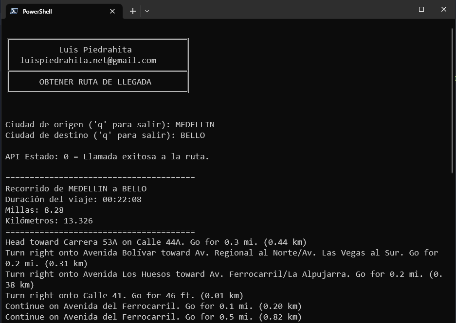
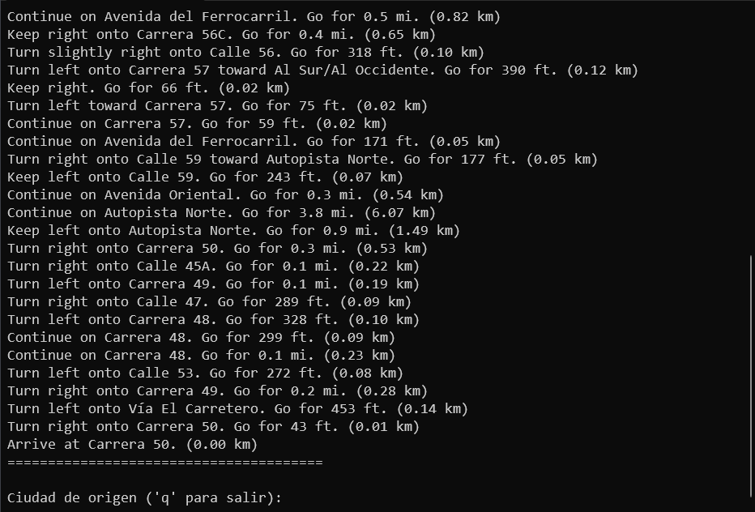

<h1>
Ruta de transporte
</h1>

<p>
Esta aplicación desarrollada en Python pide al usuario una ciudad de origen y una ciudad de destino para encontrar la ruta de transporte.
</p>

<div align="center">

<br/>

</div>


<p>Utiliza la API de <a href="https://www.mapquest.com" target="_blank">Mapquest</a> para obtener la información de la ruta a seguir en el transporte, duración del viaje, las millas y los kilómetros</p>

<p>Para instalar solo tienes que poner tu clave de <a href="https://www.mapquest.com" target="_blank">Mapquest</a> en el fichero ruta.py</p>

```
key      = "tu_clave_de_Mapquest"
```
